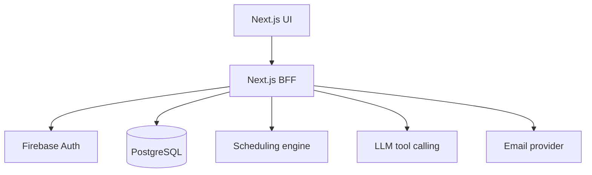

# Architecture

## 1. Context

The legacy SJSM application is a React single-page application that accesses Firebase Authentication and Firestore directly from the browser. This project introduces a server boundary, a relational domain model, a scheduling engine, notifications, and a controlled conversational assistant.

## 2. Target architecture

## 3. Deployment architecture

- Firebase App Hosting is the public front door and managed Next.js runtime.
- App Hosting builds from GitHub, stores the image in Artifact Registry, runs it on Cloud Run, and serves it through Cloud CDN.
- PostgreSQL uses Neon in Singapore with a pooled runtime connection.
- Minimum running instances remain zero in non-critical environments to control cost.
- Production secrets are stored in Google Cloud Secret Manager and referenced by `apphosting.yaml`.
- Firebase Admin uses platform-provided Application Default Credentials; no service-account key is deployed.

The decision, alternatives, and cost implications are recorded in [ADR 0002](adr/0002-use-firebase-app-hosting-and-neon.md). Operational steps and deployment evidence are in the [deployment runbook](deployment.md).

## 4. Application boundaries

### Next.js application

- renders the user interface;
- verifies authentication at the server boundary;
- enforces role-based authorization;
- exposes versioned route handlers;
- orchestrates database, solver, email, and AI calls;
- owns confirmation flows and audit records.

### Scheduling domain

- defines hard and soft constraints;
- transforms domain data into solver input;
- generates candidate rosters;
- returns structured scores and explanations;
- contains no UI or transport concerns.

### Conversational assistant

- classifies supported intents;
- extracts validated parameters;
- requests only allowlisted tools;
- never queries the database directly;
- cannot publish a roster;
- requires confirmation tokens for write operations.

## 5. Initial domain model

- `users`
- `roles`
- `user_roles`
- `services`
- `service_role_requirements`
- `availability`
- `planning_periods`
- `roster_candidates`
- `assignments`
- `replacement_requests`
- `scheduling_constraints`
- `notification_deliveries`
- `audit_events`

Database constraints and transactions protect invariants in addition to application validation.

## 6. Authentication flow

1. The browser signs in with Firebase Authentication.
2. The browser sends the Firebase ID token to the Next.js backend.
3. The backend verifies the token with Firebase Admin SDK.
4. The backend resolves the Firebase UID to an application user.
5. Authorization is evaluated server-side for every protected operation.

## 7. AI tool boundary

Initial assistant tools:

- `get_my_next_assignment` — implemented (`POST /api/v1/assistant/ask`, US-07)
- `get_my_assignments_for_period`
- `get_my_availability`
- `prepare_mark_unavailable`
- `confirm_mark_unavailable`

The authenticated user ID is injected by the server and is never accepted from model-generated arguments.

`get_my_next_assignment` is implemented as an LLM structured-output classification
(`src/assistant/gemini-intent-classifier.ts`, Gemini 3.1 Flash-Lite — see
[ADR 0003](adr/0003-use-gemini-flash-lite-for-assistant-classification.md))
over three allowlisted outcomes — the supported tool, `unsupported_request`,
or `clarification_needed` — plus locale detection (`en`/`zh`). The server
executes the actual structured query
(`SmartRosterService.listMyUpcomingAssignments`) and composes the reply from a
fixed, per-locale template (`src/assistant/reply-templates.ts`); the LLM never
authors the final user-facing sentence and never supplies a user ID. Any
classifier failure (parse error, rate limit, network error) degrades to a
safe `ambiguous` clarification rather than a 500. The provider lives behind
a small `IntentClassifier` interface (`src/assistant/types.ts`), so swapping
providers touches only the classifier file, not the service, templates, or
route.

## 8. Testing strategy

- Unit tests for domain rules, scoring, authorization, and parameter validation.
- Property-based or generated tests for scheduling invariants.
- Integration tests for API, database transactions, authentication adapters, and email outbox behavior.
- Contract tests for solver and LLM tool schemas.
- End-to-end tests for roster generation, publication, personal queries, and confirmed availability updates.
- Evaluation dataset for conversational intents, including ambiguous and unauthorized requests.

## 9. Migration strategy

1. Capture the legacy data shape and create anonymized fixtures.
2. Build the new schema and one-time migration script.
3. Validate counts, relationships, and representative records.
4. Run a limited acceptance test with synthetic or approved data.
5. Plan a maintenance window for final migration if the church adopts the new system.

Dual-write is not an MVP requirement. The Capstone demonstration must not depend on live production member data.
