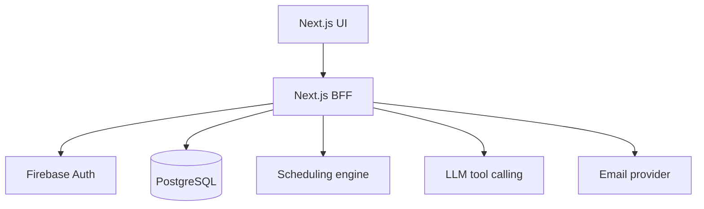

# Design and Testing

This is the canonical design-and-testing record for the MSSE Capstone submission. It
summarizes decisions and evidence that are also documented in more detail elsewhere
in `docs/`; those documents remain the source of truth and are linked throughout.

## 1. Architecture overview

SmartRoster replaces a browser-to-Firestore legacy application with a server-authoritative
design:

- **Next.js application** (`src/app`, `src/api`, `src/server`) — renders the UI, verifies
  Firebase ID tokens, enforces role-based authorization, and exposes versioned
  `/api/v1` route handlers.
- **Scheduling domain** (`src/domain`) — pure TypeScript, no UI or transport
  dependencies. Defines hard/soft constraints, transforms domain data into solver
  input, and produces scored, explainable candidate rosters.
- **Persistence** (`src/db`) — Drizzle ORM schema and a `DomainRepository`
  implementation. The domain layer depends only on the `DomainRepository`
  interface (`src/domain/types.ts`), not on Drizzle directly, so the solver and
  business rules stay testable without a database.
- **Auth** (`src/auth`) — Firebase ID-token verification plus a permission table
  mapping roles (volunteer / team leader / administrator) to allowed operations
  (e.g. `roster:generate`, `roster:publish`).
- **Conversational assistant** (planned for Sprint 3, architecture defined in
  [architecture.md §7](architecture.md#7-ai-tool-boundary)) — restricted to an
  allowlist of tools, cannot query the database directly, and cannot publish a
  roster. The authenticated user ID is injected by the server and is never
  accepted from model-generated arguments.

Full narrative and the deployment diagram: [architecture.md](architecture.md).
Full entity list and invariants: [domain-model.md](domain-model.md).

## 2. Architectural and design patterns

| Pattern | Where | Why |
| --- | --- | --- |
| Backend-for-frontend (BFF) | `src/app/api/v1/*` route handlers | Next.js serves both UI and API behind one authenticated server boundary; the browser never talks to Firestore/Postgres directly. |
| Repository interface / dependency inversion | `src/domain/types.ts` (`DomainRepository`) implemented by `src/db/domain-repository.ts` | Keeps constraint-optimization and scoring logic in `src/domain` free of SQL and framework concerns, so it can be unit-tested in isolation and swapped onto a different store if needed. |
| Domain service layer | `src/domain/smart-roster-service.ts` | Single entry point the route handlers call; route handlers stay thin (parse/validate/authorize/respond) and never contain business rules. |
| Constraint-based generation over free-form generation | `src/domain/roster-generator.ts` | Roster generation is deterministic bipartite matching over explicit hard constraints (active, role-qualified, not unavailable) and weighted soft preferences (primary-role fit, availability preference, load balance) — not an LLM guess. This is a hard product requirement: generation must report infeasibility rather than silently violate a hard constraint, and it never auto-publishes. |
| Versioned, auditable state transitions | `roster_candidates` (`draft` / `published` / `superseded`), `assignments.isLocked` / `source` | Every generation is a new version; publishing is a deliberate, auditable, atomic transition, not an in-place mutation. This directly supports Sprint 2's lock/regenerate/publish user stories (#4–#6). |
| Defense in depth via database constraints | `drizzle/0000_icy_sage.sql`, `src/db/schema.ts` | Invariants that matter (only one published candidate per planning period, published ⇒ hard constraints satisfied, one role per user per service per candidate, unique notification idempotency key) are enforced with SQL check/unique constraints in addition to application validation, so a bug in application code cannot silently corrupt the schedule. |
| Retry-safe outbox-style delivery | `notification_deliveries.idempotencyKey` (unique) | Notification retries are safe by construction at the database layer, not just by application-level care. |

## 3. Key technology decisions (ADRs)

Full architecture decision records: [docs/adr/](adr/).

- **[ADR 0001](adr/0001-use-drizzle-for-postgresql.md) — Drizzle over Prisma.**
  Chosen because generated SQL stays reviewable and PostgreSQL-specific
  constructs (partial unique indexes, check constraints) are exposed directly
  rather than hidden behind a separate schema language — important for a
  constraint-heavy scheduling domain. `postgres.js` is the production driver;
  PGlite runs the real migration in tests and CI without a shared database.

- **[ADR 0002](adr/0002-use-firebase-app-hosting-and-neon.md) — Firebase App
  Hosting + Neon Postgres over Vercel / manual Cloud Run.** The legacy app is a
  Firebase Authentication + Firestore client; App Hosting keeps that operational
  boundary while adding a trusted Next.js server. Alternatives considered and
  why they were rejected:

  | Option | Decision | Reason |
  | --- | --- | --- |
  | Firebase App Hosting (selected) | ✅ | Native Next.js support, GitHub-linked rollouts with rollback, Secret Manager + Cloud Logging, scale-to-zero |
  | Firebase Hosting + manual Cloud Run rewrite | Rejected | Same runtime cost profile as App Hosting but with avoidable container/IAM operational work |
  | Vercel + managed Postgres | Rejected | Best-in-class Next.js support and an attractive free tier, but breaks the existing Firebase operational boundary the legacy app already depends on |
  | Firebase Hosting only (static) | Rejected | Cannot run Next.js server-rendered routes/route handlers at all |

  **Cost implications** (deployment options and relative cost, as required for
  the design document): App Hosting requires the Firebase project to be on the
  pay-as-you-go Blaze plan and a billing account, but the underlying Cloud Run
  service scales to zero (`minInstances: 0`, capped `maxInstances: 3` in
  `apphosting.yaml`); Firebase's own published example estimates roughly
  USD 0.01 per 10,000 monthly visits under low, intermittent traffic, though
  that is not a guarantee. Neon's free tier (0.5 GB storage, 100 CU-hours per
  project, idle compute scaling to zero) covers Capstone and small-pilot usage
  at no cost, at the expense of an occasional cold-start delay after
  inactivity. Both choices trade a small latency/cold-start cost for
  effectively zero idle spend, which matches this project's low, intermittent
  traffic profile. This should be revisited (see ADR 0002 "Revisit when") if
  traffic, storage, or private-networking requirements grow. Deployment
  evidence for the first live release is recorded in
  [deployment.md](deployment.md).

- **[ADR 0003](adr/0003-use-gemini-flash-lite-for-assistant-classification.md)
  — Gemini 3.1 Flash-Lite (free tier) for assistant intent classification.**
  Cheaper than Claude Haiku even on its paid tier, and effectively free for
  Capstone demo traffic. The provider is isolated behind a one-method
  `IntentClassifier` interface, so this was a same-day swap from an initial
  Claude implementation with zero changes to `AssistantService`, the reply
  templates, or the route. **Important caveat**: the free tier's terms permit
  Google to use submitted content to improve their models — acceptable for
  synthetic Capstone demo data, but the ADR explicitly flags that production
  use with real volunteer messages must move to the paid tier first.

## 4. Domain model summary

| Area | Tables | Purpose |
| --- | --- | --- |
| Identity | `users`, `roles`, `user_roles` | Firebase-linked users, authorization role, service-role qualifications |
| Planning | `planning_periods`, `services`, `service_role_requirements`, `availability` | Dates, services, required capacity, volunteer date preferences |
| Optimization | `scheduling_constraints`, `roster_candidates`, `assignments` | Solver inputs, versioned outputs, scores, explanations, locked assignments |
| Operations | `replacement_requests`, `notification_deliveries`, `audit_events` | Replacement workflow, retry-safe email delivery, immutable activity evidence |

Full table list, relationships, and invariants: [domain-model.md](domain-model.md).

## 5. Testing strategy

The intended test pyramid ([architecture.md §8](architecture.md#8-testing-strategy)):

- Unit tests for domain rules, scoring, authorization, and parameter validation.
- Property-based/generated tests for scheduling invariants.
- Integration tests for API, database transactions, authentication adapters, and
  email outbox behavior.
- Contract tests for solver and LLM tool schemas.
- End-to-end tests for roster generation, publication, personal queries, and
  confirmed availability updates.
- An evaluation dataset for conversational intents (Sprint 3), including
  ambiguous and unauthorized requests.

### What exists today

All tests run against a real PostgreSQL-compatible engine (PGlite) executing the
actual committed migration — chosen in [ADR 0001](adr/0001-use-drizzle-for-postgresql.md)
specifically so integration tests exercise real SQL constraints instead of a mocked
repository. Current suite (`npm test`, Vitest): **14 test files, 99 tests, all
passing**.

The conversational assistant (US-07) additionally follows the pattern
`docs/architecture.md §8` calls for: unit and contract tests run in CI against
a fake/injected classifier (no network, no secret), while a curated
English/Chinese evaluation dataset (`npm run assistant:eval`) is a separate,
manually-run script — mirroring `npm run migration:legacy-spike` — because it
calls the real Gemini API and must not gate every PR on live model output
or a committed API key. The provider choice (Gemini 3.1 Flash-Lite, free
tier for the Capstone demo only) and its production caveat are recorded in
[ADR 0003](adr/0003-use-gemini-flash-lite-for-assistant-classification.md).

| File | Covers |
| --- | --- |
| `src/db/schema.test.ts` | Migration applies cleanly; schema-level constraints (uniqueness, check constraints) behave as designed. |
| `src/api/api-flow.test.ts` | End-to-end route-handler flows against a real migrated database, including roster-candidate generation, review, locking, regeneration, publication, and the assistant's ask/confirm endpoints (with a fake classifier) — including a full prepare-then-confirm round trip verified against real availability rows. |
| `src/assistant/assistant-service.test.ts` | Assistant reply logic against a fake classifier and a real `SmartRosterService`: correct EN/ZH templates, no-upcoming-assignment case, clarification/unsupported short-circuit without querying assignments, that only the authenticated actor's ID is ever used even if the classifier tries to supply one (US-07); and the full prepare/confirm write flow — no write on prepare alone, cancel-by-not-confirming, confirm executes the write, wrong-user and tampered-token rejection, and re-validating the date at confirm time even though prepare accepted it (US-08). |
| `src/assistant/confirmation-token.test.ts` | The HMAC-signed confirmation token: round-trip, wrong secret, tampered payload, malformed token, and expiry boundary (US-08). |
| `src/assistant/gemini-intent-classifier.test.ts` | The classification contract (allowlisted tools, supported locales, resolved-date format) and the real classifier's mapping/fallback logic against a fake Gemini client — no network call. |
| `src/domain/smart-roster-service.test.ts` | Domain service methods (planning periods, services, roles, availability, assignment listing) against a fake `DomainRepository`. |
| `src/domain/roster-generator.test.ts` | The constraint-based roster generator: hard-constraint enforcement (inactive/unavailable/unqualified volunteers excluded), infeasibility reporting for unfilled roles, soft-constraint scoring (primary-role fit, availability preference, load balance), coverage/fairness measures (US-04), and lock-aware regeneration including infeasible-lock detection (US-05). |
| `src/auth/firebase-token-verifier.test.ts`, `src/auth/authorize.test.ts`, `src/auth/permissions.test.ts` | Firebase ID-token verification and role-based authorization, including negative/denied cases. |
| `src/migration/legacy-migration.test.ts` | Legacy migration spike behavior (synthetic-data-only guard, aggregate validation output). |
| `src/i18n/config.test.ts` | English/Simplified Chinese locale configuration required by the product's bilingual UI rule. |
| `src/lib/health.test.ts` | `/api/health` deployment-verification endpoint. |
| `src/deployment/apphosting-config.test.ts` | `apphosting.yaml` configuration (e.g. `minInstances`/`maxInstances`) matches the deployment ADR. |

Domain logic (`src/domain`) is tested without a database at all — it depends only
on the `DomainRepository` interface — while API/schema tests exercise the real
migrated database. This means correctness of the scheduling rules and correctness
of the persistence/constraint layer are verified independently, and a passing
suite gives evidence for both.

### CI/CD enforcement

- **`.github/workflows/ci.yml`** — runs on every pull request and every push to
  `main`: install → lint (`eslint`, zero warnings) → type check (`tsc --noEmit`)
  → test (`vitest run`) → build (`next build`). A PR cannot merge with a red
  build, so `main` always reflects code that lints, type-checks, tests, and
  builds.
- **`.github/workflows/database-migrate.yml`** — a separate, manually-triggered
  (`workflow_dispatch`) workflow that applies committed Drizzle migrations to
  the live Neon database only when a human types the literal confirmation
  string `MIGRATE`, and only from `main`. Schema changes are never
  auto-applied to the production database by a merge.

### Why this shape

- Real Postgres-compatible tests over mocks: the domain model relies on
  database-level check/unique constraints as a second line of defense (see
  §2 above); mocking the repository in integration tests would hide exactly
  the invariant violations those tests exist to catch.
- Pure, DB-free domain unit tests: the scheduling engine (`roster-generator.ts`)
  is the highest-risk, most novel logic in the system (US-03, "Generate a
  candidate roster") and must remain fast and deterministic to test — no
  database or network round-trip is needed to verify constraint/scoring logic.
- CI gating over manual review alone: lint/typecheck/test/build on every PR
  gives the "appropriate collaborative software engineering tools, including
  CI/CD tools" evidence the Capstone rubric asks for, and keeps `main`
  deployable at every merge, which matters because `main` auto-deploys via
  Firebase App Hosting.

## 6. Traceability: user stories to code

| Story | Status | Key code |
| --- | --- | --- |
| US-01 View my upcoming assignments | Done (#1) | `src/app/api/v1/me/assignments` |
| US-02 Record unavailability | Done (#2) | `src/app/api/v1/me/availability` |
| US-03 Generate a candidate roster | Done (#3, PR #24) | `src/domain/roster-generator.ts`, `src/app/api/v1/planning-periods/[periodId]/candidates` |
| US-04 Review fairness and explanations | Done (#4) | `src/domain/roster-generator.ts` (coverage/fairness metrics), `GET .../candidates`, `GET .../candidates/{candidateId}` |
| US-05 Lock and regenerate | Done (#5) | `PATCH .../candidates/{candidateId}/assignments/{assignmentId}`, `POST .../candidates/{candidateId}/regenerate`, `regenerateRosterCandidate` in `src/domain/roster-generator.ts` |
| US-06 Publish a roster | Done (#6) | `POST .../candidates/{candidateId}/publish`, `publishRosterCandidate` in `src/db/domain-repository.ts` |
| US-07 Ask for my next assignment | Done (#7) | `POST /api/v1/assistant/ask`, `src/assistant/` (service, Gemini classifier, templates), `npm run assistant:eval` |
| US-08 Update availability through conversation | Done (#8) | `POST /api/v1/assistant/ask` (prepare), `POST /api/v1/assistant/confirm`, `src/assistant/confirmation-token.ts` |
| US-09 Notify assigned volunteers | Open (#9) | `notification_deliveries` (schema already in place) |

Full acceptance criteria for each story: [capstone-plan.md](capstone-plan.md).
Live task tracking: the [GitHub Project board](https://github.com/users/wangfanxu/projects/1) and [issue tracker](https://github.com/wangfanxu/sjsm-smart-roster/issues).
